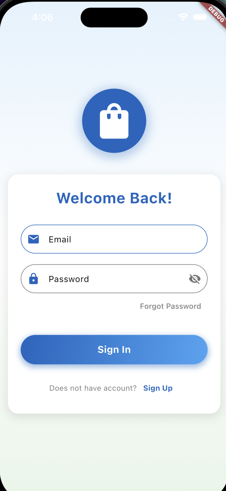
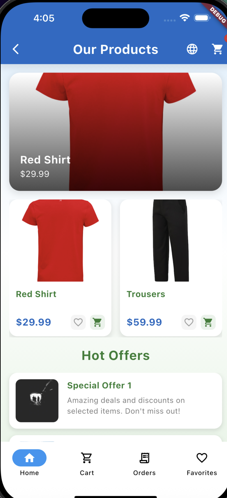
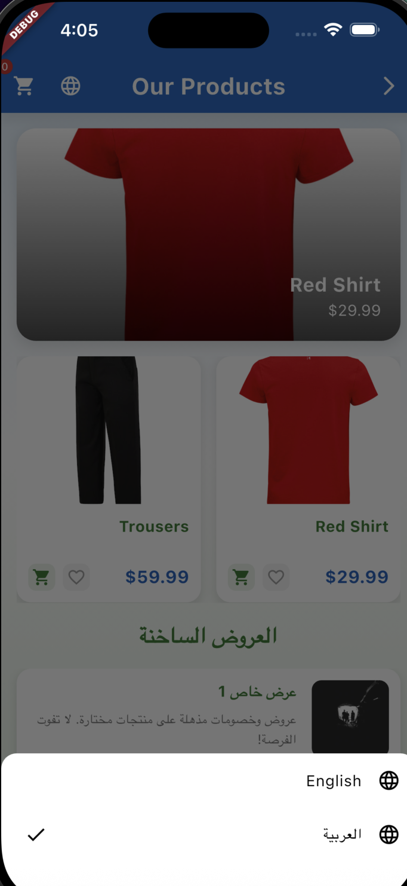
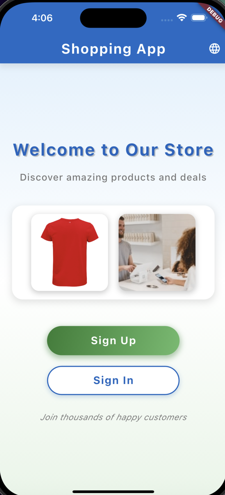
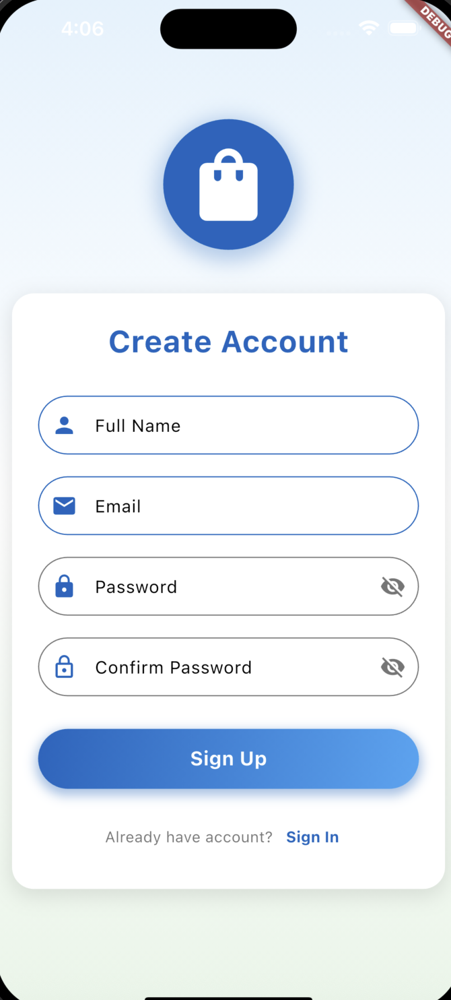

# Flutter Shopping App

A beautiful and feature-rich Flutter shopping application with multi-language support (English/Arabic) and modern UI design.

## 📱 Project Overview

This Flutter shopping app provides a complete e-commerce experience with an aesthetic welcome screen, user authentication, product browsing, and shopping cart functionality. The app features a modern design with smooth animations, custom typography, and full Arabic language support.

## ✨ Features

### 🎨 Aesthetic Welcome Screen
- Custom AppBar with "Shopping App" title
- Two images displayed in a responsive row layout (local + online)
- Custom Suwannaphum-Regular font with bold styling and colors
- Centered layout with adequate spacing
- Gradient "Sign Up" and outlined "Sign In" buttons with smooth animations

### 🔐 Authentication System
- **Sign-Up Form**:
  - Full Name field with uppercase first letter validation
  - Email field with @ symbol requirement
  - Password field with 6+ character minimum
  - Confirm Password with matching validation
  - Success dialog: "Account created successfully"
- **Sign-In Form**:
  - Email field with @ validation
  - Password field with 6+ character minimum
  - Success dialog: "Account sign-in successfully"
- **Reset Password**:
  - Username (optional), Email, New Password, Confirm Password fields
  - Comprehensive validation with user-friendly error messages
  - Success confirmation with navigation back to auth screen

### 🛍️ Shopping Home Screen
- **AppBar**: "Our Products" title with cart icon and language picker
- **Horizontal PageView**: Featured product images with overlay text and pricing
- **Responsive GridView**: 2 products per row with enhanced card design
- **Add to Cart**: Functional buttons with "Item added to the cart" SnackBar feedback
- **Hot Offers Section**: ListView.builder with 5 scrollable offers, each with image and description

### 🎯 Additional Features
- **Unified Color Scheme**: Consistent deep blue primary (#1565C0) and green secondary (#2E7D32) colors
- **Smooth Animations**: Page transitions with fade and slide effects
- **Arabic Language Support**: Complete localization with proper .arb files
- **Custom Typography**: Suwannaphum-Regular font throughout the application
- **Responsive Design**: Works seamlessly on different screen sizes
- **Professional UI**: Gradients, shadows, and proper visual hierarchy

## 🌍 Language Support

The app supports both English and Arabic languages:

### English
- "Our Products"
- "Hot Offers"
- All form labels and validation messages

### Arabic (العربية)
- "منتجاتنا" (Our Products)
- "العروض الساخنة" (Hot Offers)
- Complete Arabic translations for all UI elements

## 🏗️ Project Structure

```
lib/
├── constants/
│   └── app_colors.dart          # Unified color scheme
├── l10n/
│   ├── app_en.arb              # English translations
│   ├── app_ar.arb              # Arabic translations
│   ├── app_localizations.dart   # Generated localization
│   ├── app_localizations_en.dart
│   └── app_localizations_ar.dart
├── models/
│   ├── order.dart              # Order model
│   └── product.dart            # Product model
├── providers/
│   ├── auth_provider.dart      # Authentication state management
│   ├── cart_provider.dart      # Shopping cart state management
│   ├── locale_provider.dart    # Language switching
│   ├── orders_provider.dart    # Orders management
│   └── product_provider.dart   # Products management
├── screens/
│   ├── auth_screen.dart        # Sign-up/Sign-in screen
│   ├── cart_screen.dart        # Shopping cart screen
│   ├── favorites_screen.dart   # Favorites screen
│   ├── forgot_password_screen.dart # Password reset screen
│   ├── home_screen.dart        # Main shopping screen
│   ├── main_tab_screen.dart    # Bottom navigation
│   ├── orders_screen.dart      # Orders history
│   ├── product_detail_screen.dart # Product details
│   └── welcome_screen.dart     # Welcome/landing screen
├── widgets/
│   └── language_picker.dart    # Language selection widget
└── main.dart                   # App entry point
```

## 🚀 Setup Instructions

### Prerequisites
- Flutter SDK (3.8.1 or higher)
- Dart SDK
- Android Studio / VS Code
- iOS Simulator / Android Emulator

### Installation Steps

1. **Clone the repository**
   ```bash
   git clone https://github.com/[username]/flutter-shopping-app.git
   cd flutter-shopping-app
   ```

2. **Install dependencies**
   ```bash
   flutter pub get
   ```

3. **Generate localization files**
   ```bash
   flutter gen-l10n
   ```

4. **Run the app**
   ```bash
   flutter run
   ```

### Build for Production

**Android APK:**
```bash
flutter build apk --release
```

**iOS:**
```bash
flutter build ios --release
```

## 📦 Dependencies

```yaml
dependencies:
  flutter:
    sdk: flutter
  cupertino_icons: ^1.0.8
  intl: ^0.20.2
  google_fonts: ^6.2.1
  provider: ^6.1.2
  flutter_localizations:
    sdk: flutter

dev_dependencies:
  flutter_test:
    sdk: flutter
  flutter_lints: ^5.0.0
```

## 🎨 Design System

### Color Palette
- **Primary**: Deep Blue (#1565C0)
- **Primary Light**: Light Blue (#42A5F5)
- **Secondary**: Deep Green (#2E7D32)
- **Secondary Light**: Light Green (#66BB6A)
- **Background**: Light Gray (#F5F5F5)
- **Surface**: White (#FFFFFF)
- **Text Primary**: Dark Gray (#212121)
- **Text Secondary**: Medium Gray (#757575)

### Typography
- **Font Family**: Suwannaphum-Regular
- **Sizes**: 32px (titles), 24px (headers), 18px (body), 16px (labels)
- **Weights**: Bold for headers, Regular for body text

## 📱 Screenshots

### 🏠 Home Screen Features

*Home screen showing "Our Products" with featured red shirt, product grid including Red Shirt ($29.99) and Trousers ($59.99), and Hot Offers section with Special Offer 1*


*Arabic language support with RTL layout showing "منتجاتنا" (Our Products) and "العروض الساخنة" (Hot Offers) with language picker displaying English/العربية options*

### 🎯 Welcome & Authentication

*Welcome screen with "Shopping App" title, "Welcome to Our Store" message, product showcase images, and Sign Up/Sign In buttons*


*Create Account form with shopping bag icon, Full Name, Email, Password, and Confirm Password fields with validation*


*Sign In form with "Welcome Back!" message, Email and Password fields, "Forgot Password" link, and "Sign Up" option*

> **Note**: Screenshots showcase the complete app functionality including English/Arabic language support, authentication flows, product browsing, and shopping features with real product data.

## 🔧 Technical Features

- **State Management**: Provider pattern for scalable state management
- **Internationalization**: Complete i18n setup with .arb files
- **Form Validation**: Comprehensive validation with user-friendly error messages
- **Navigation**: Smooth transitions between screens with custom animations
- **Asset Management**: Proper image loading with error handling
- **Responsive Design**: Adaptive layouts for different screen sizes

## 🤝 Contributing

1. Fork the repository
2. Create your feature branch (`git checkout -b feature/AmazingFeature`)
3. Commit your changes (`git commit -m 'Add some AmazingFeature'`)
4. Push to the branch (`git push origin feature/AmazingFeature`)
5. Open a Pull Request

## 📄 License

This project is licensed under the MIT License - see the [LICENSE](LICENSE) file for details.

## 👨‍💻 Author

**Fathallah Samir**
- GitHub: [@Fathallahs](https://github.com/Fathallahs)
- Email: fathallahsamir88@gmail.com

## 🙏 Acknowledgments

- Material Design for design guidelines
- Unsplash for placeholder images
- Google Fonts for typography resources

---

**Made with ❤️ using Flutter**
